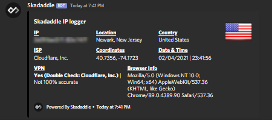
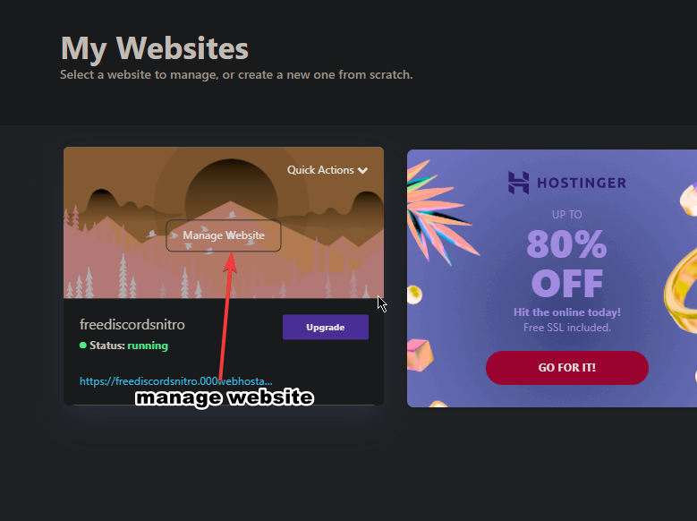
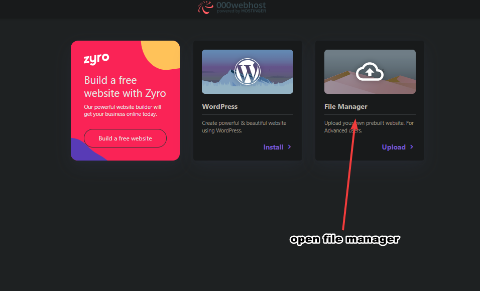
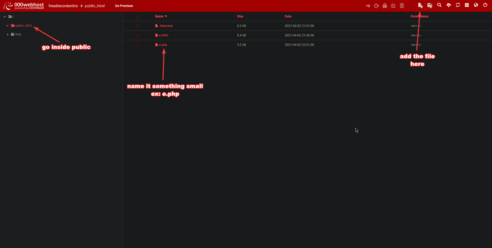

# php-ip-logger
nothing too special just a php ip logger with og support

# What quick info
    1. It has OG(open graph) support which means u can be creative with the link embed
    2. you can easily phish the link in discord you can see in #what it looks like
    3. can detect vpns [very buggy with phones] due to ipv6
    4. you can easily add cookie logging if you're creative
    5. Has auto redirect you can change it to discord.com but i have it as skadaddle.cc check it at the end of the code
    it just makes the link less sus. somewhat??
    

# What It Looks Like
  
    
phished link pic   


#  steps
```Nim
1. go to https://www.000webhost.com/free-website-sign-up and create an acc
2. create a website https://www.000webhost.com/members/website/list just do it real quick
3. after you made the website go back to 
https://www.000webhost.com/members/website/list and click on manage website on ur site
5. after that you will see "file manager" click on that
6. then go to public hmtl
7. make a .php file and name it something small like a.php
8. put the code in it
9. get your website link for ex: https://freediscordsnitro.000webhostapp.com/
then add your file name so if its a.php it will be 'https://freediscordsnitro.000webhostapp.com/a.php'
10. on line 11 in the php file put your link which should have the .php at the end of it
```
# images to help you after you make the website





# THIS IS FOR EDUCTIONAL PURPOSES ONLY!!!
